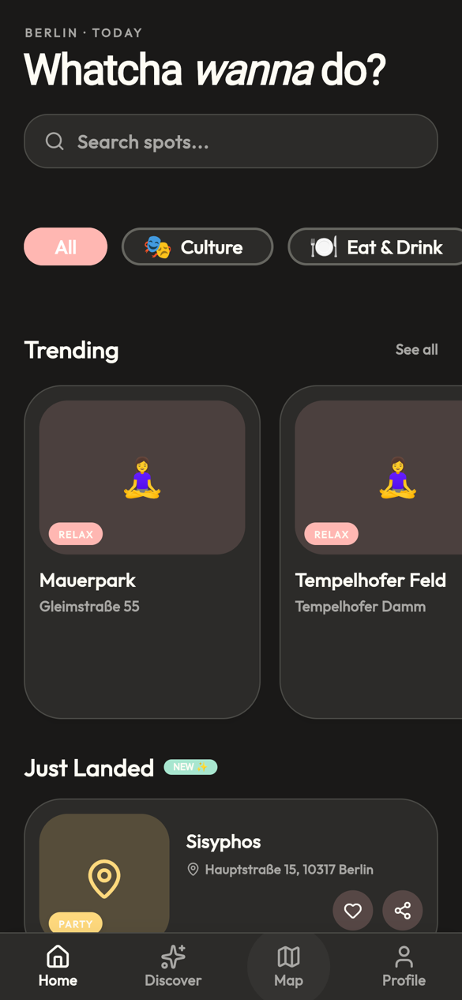
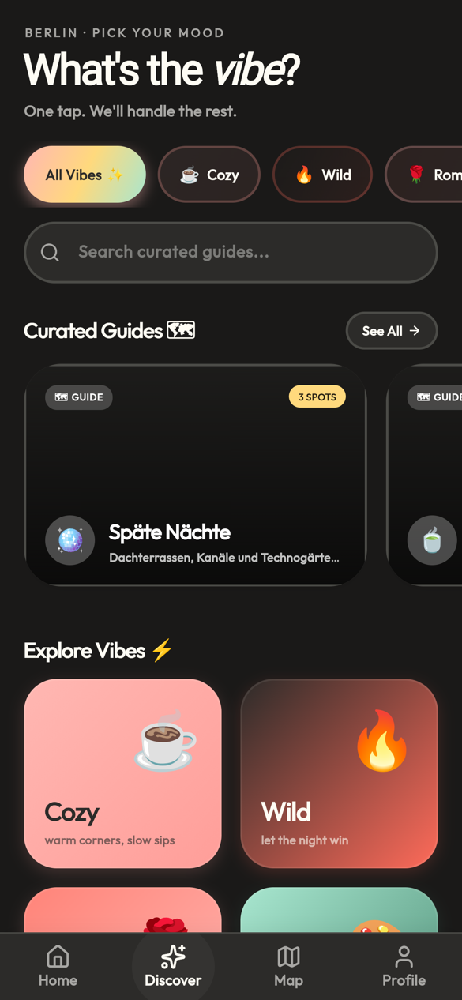
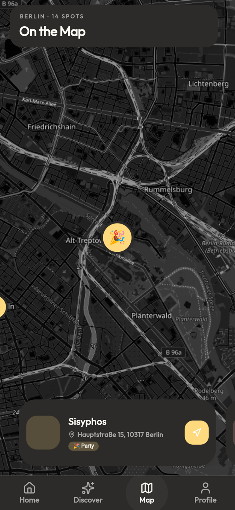
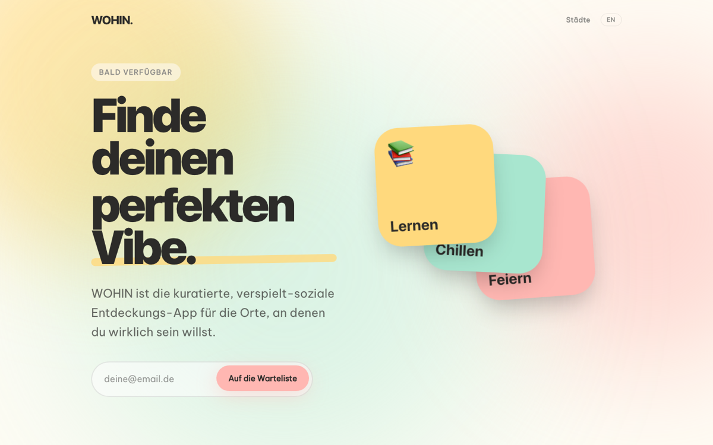
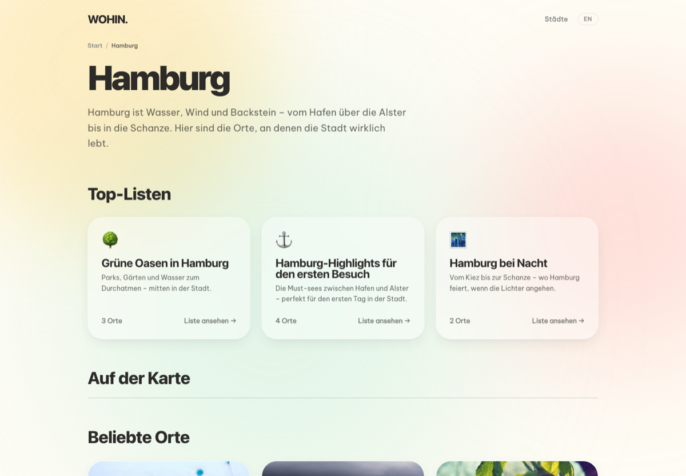
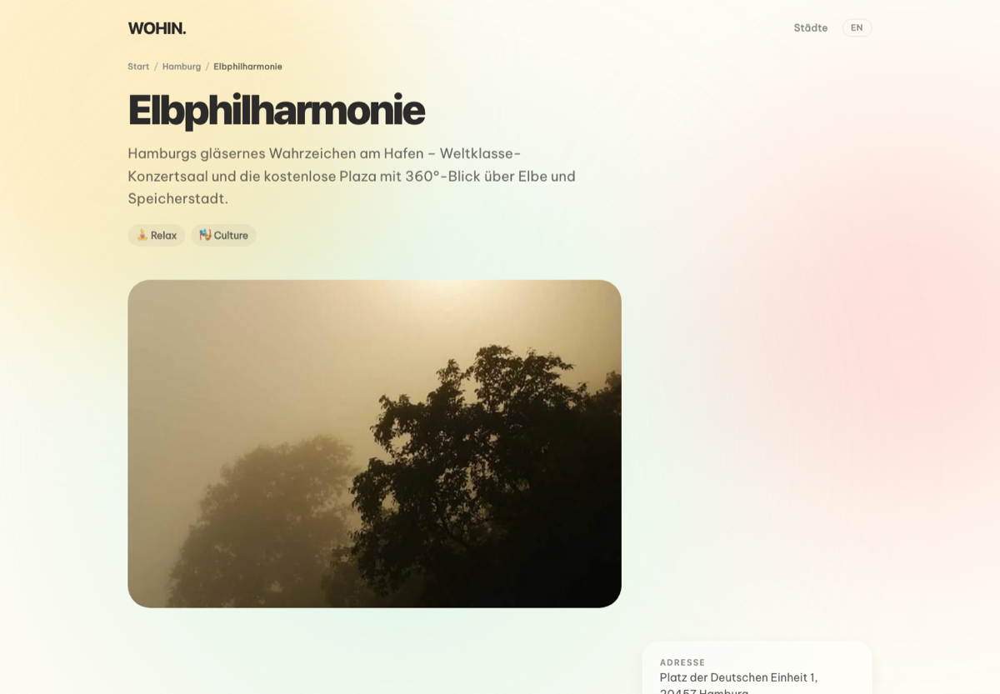
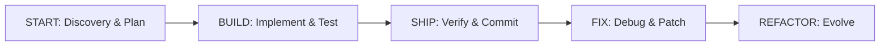

# WOHIN

**Finde deine Lieblingsorte – kuratiert, verspielt, sozial.**

WOHIN ist eine Entdeckungs-App für die Orte, an denen man wirklich sein will:
Cafés, Parks, Clubs und Geheimtipps, sortiert nach *Vibe* statt nach Sternen.
Das Projekt besteht aus einer zweisprachigen (DE/EN) SEO-Website, einem
Discovery-API-Backend, einem Headless CMS und einer Flutter-App – alle
bedienen sich aus derselben Datenquelle.

## Screenshots

### Mobile App (Flutter)

<p align="center">
  
  
  
  
</p>

| Onboarding | Home | Discover | Map |
|---|---|---|---|
| Einstieg in drei Schritten | Suche, Kategorien, Trending & neue Spots | Vibe-Filter und kuratierte Guides | Spots auf der Karte mit Schnellvorschau |

### Website (Astro)



| Stadt | Top-Liste | Ort |
|---|---|---|
|  |  |  |

## Architektur

```
Sanity (wohin-cms)  ──>  wohin-backend (Hono / Cloudflare Workers)  ──┬──>  wohin-site (Astro, statisch)
   Inhalte + i18n          eine Quelle der Wahrheit, Locale-Auflösung  └──>  wohin-app  (Flutter)
```

| Ordner | Inhalt |
|---|---|
| [`wohin-site/`](wohin-site) | Öffentliche Website – DE/EN Stadtguides und Top-Listen, SEO-optimiert. Siehe [docs/WEB.md](docs/WEB.md) |
| [`wohin-backend/`](wohin-backend) | Discovery-API (Hono auf Cloudflare Workers), Waitlist, Auth, Feedback |
| [`wohin-cms/`](wohin-cms) | Sanity Studio: `city`, `location`, `activity`, `curatedList` |
| [`wohin-app/`](wohin-app) | Flutter-App (Riverpod, flutter_map). Siehe [docs/FLUTTER_DEV.md](docs/FLUTTER_DEV.md) |
| [`.specify/`](.specify) | Governance- und Workflow-Templates |

## Features

- **Vibe-first Discovery** – Orte nach Stimmung filtern (Cozy, Wild, Romantic …)
- **Kuratierte Guides & Top-Listen** – redaktionell gepflegt, rankbar, teilbar
- **Karte** – Spots auf OpenStreetMap-Basis, Schnellvorschau und Navigation
- **Vibe Checks** – Community-Feedback pro Ort
- **Zweisprachig** – feldgenaue Übersetzungen (DE/EN) mit Fallback auf Deutsch
- **SEO** – hreflang, JSON-LD (`ItemList`, `TouristAttraction`, `BreadcrumbList`), Sitemap
- **Neue Städte per Content** – Stadt anlegen im CMS, kein Code nötig

## Entwicklung

Monorepo mit **Bun** für die JS-Teile und der **Flutter CLI** für die App.

```bash
bun install
bun dev              # CMS + Backend parallel
```

Einzelne Teile:

```bash
bun run dev:cms      # Sanity Studio
bun run dev:backend  # Hono / wrangler dev (Port 8787)
bun run dev:site     # Astro
bun run dev:ios      # iOS-Simulator booten + App starten
cd wohin-app && flutter run
```

Konfiguration:

- Backend: `wohin-backend/.dev.vars.example` nach `.dev.vars` kopieren
- Site: `wohin-site/.env.example` nach `.env` kopieren (`PUBLIC_WOHIN_API` zeigt auf das Backend)
- App: `lib/config/api_config.dart` – Standard ist `http://localhost:8787`

### Screenshots neu erzeugen

Die Bilder in `docs/screenshots/` stammen aus dem statischen Site-Build
(`wohin-site/dist`) und einem Flutter-Web-Build der App (`flutter build web`),
jeweils im Headless-Chromium bei Handy- bzw. Desktop-Viewport.

## Governance

Entwicklung folgt der **WOHIN Constitution** (`.specify/memory/constitution.md`):

1. **Vibe-First Engineering** – Fokus auf das *Was*, die KI übernimmt das *Wie*
2. **Standardisierter Lebenszyklus** – START → BUILD → SHIP
3. **Unabhängige User Stories** – testbare P1/P2/P3-Slices
4. **Automatisierte Verifikation** – Tests zuerst
5. **Modulare Architektur** – Erweiterung über Plugins und MCP-Server


