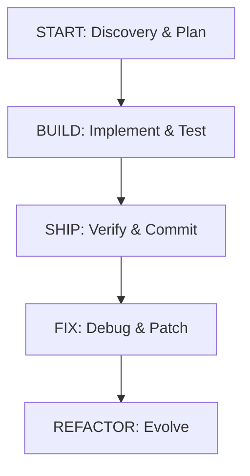

# WOHIN (Workflow-Oriented High-Integrity Network)

WOHIN is a production-grade framework for "vibe coding" with Gemini CLI and Claude Code. It implements structured workflows and specialized agents to transform intent into verified, production-ready applications.

## 🏛️ Constitution

All development is governed by the **WOHIN Constitution** (v1.0.0), located at `.specify/memory/constitution.md`.

### Core Principles

1.  **I. Vibe-First Engineering**: Focus on "WHAT" (intent), AI handles "HOW" (implementation).
2.  **II. Standardized Lifecycle**: Follow the **START → BUILD → SHIP** workflow.
3.  **III. Independent User Stories**: Features are broken into testable P1/P2/P3 MVP slices.
4.  **IV. Automated Verification**: Tests (Contract/Integration) are mandatory and written first.
5.  **V. Modular Architecture**: Extend via plugins and MCP servers.

## 🔄 The Workflow

## 📂 Project Structure

- `.specify/`: Governance and orchestration templates.
- `claude-vibes-main/`: Claude Vibes plugin for extended capabilities.
- `src/`: Core source code (when initialized).
- `tests/`: Automated tests.

## 🛠️ Getting Started

1.  Initialize with `.specify/memory/constitution.md`.
2.  Use `/speckit.specify` to define a feature.
3.  Use `/speckit.plan` to create an implementation plan.
4.  Follow the **START → BUILD → SHIP** protocol.

**Note**: This project follows strict TDD principles for all feature implementations.
